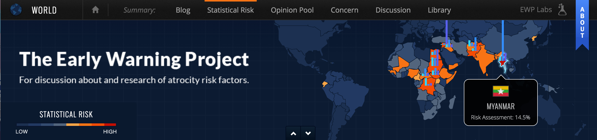
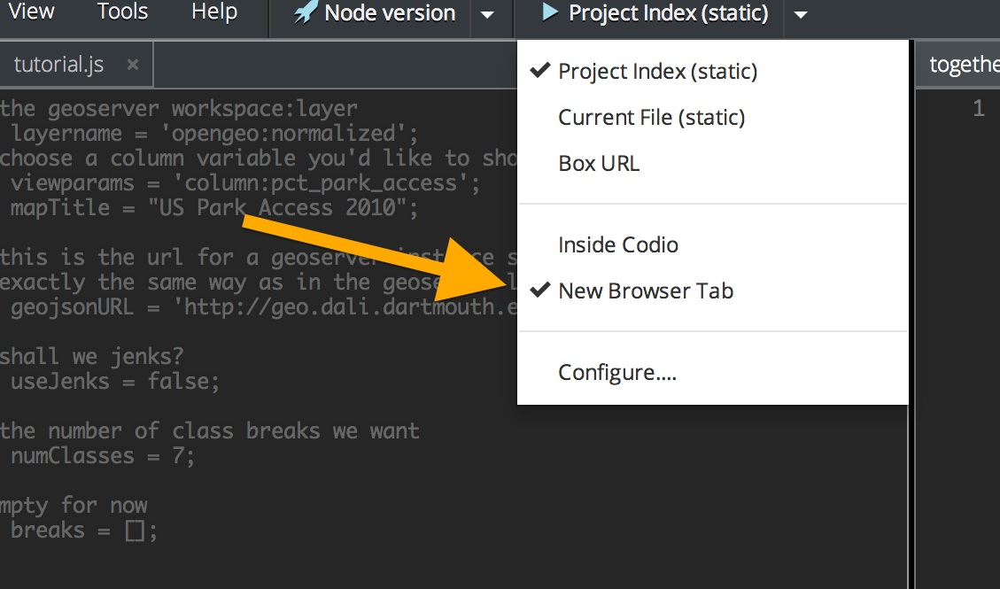
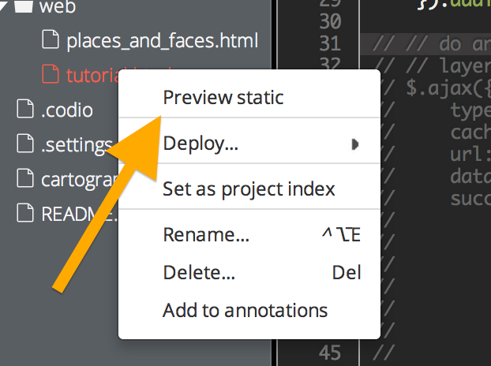

#Leaflet and Javascript Mapping
(adopted from a geog54 tutorial — W14)

## Getting Started:

We’re going to do some collaborative map coding! Go grab a small
profile picture of yourself, if you have one available on your computer. We’re going to display them as circles of 100x100 pixels, so you may want to resize them ahead of time (on a Mac you can do that with Preview, on Windows… ms paint…).

## Toolset:

[http://leafletjs.com](http://leafletjs.com) (javascript mapping
library)

[http://d3js.org/](http://d3js.org/) (javascript mapping library)

## Overview:

We will use Leaflet.js to explore some interactive map techniques.

## geoJSON:

The main data format for web maps is [geoJSON](https://en.wikipedia.org/wiki/GeoJSON). It is an open standard for representing geographic data in Javascript Object Notation.

You can see what geoJSON looks like here:
[http://geojson.io](http://geojson.io).

## Lets make our first map!

First things first.

First things first. Lets talk about the web.

-   HTML is a markup language used to describe how things look on the
    web – it isn’t a programming language, its just formatting.
-   CSS (cascading style sheets) is a way to describe rules about how
    HTML elements are styled.
-   SVG (scalable vector graphics) is a markup language (based on HTML)
    that describes vector graphics objects.
-   Javascript is a programming language that can manipulate all of the
    above.

On the left hand side you’ll notice the file viewer.

1) Now let’s create a set of your own HTML and javascript files to work
with.

1.  right click on the ‘web’ folder, and click ‘New File’

1.  name it: yourname.html
2.  choose template ‘none’ and click ok.

2.  right click on the ‘js’ folder, and click ‘New File’

3.  name it: yourname.js
4.  choose template ‘none’ and click ok.

2) Excellent. Now we’ll set up a basic map. Open up ‘yourname.html’
file and copy/paste this in
([http://pastebin.com/huWaWgcG](http://pastebin.com/huWaWgcG) ):

In the above remember to change line 24 to point to yourname.js rather
than tutorial.js!

3) Now open up your ‘yourname.js’ file and put the following in
([http://pastebin.com/rnZGK8Zg](http://pastebin.com/rnZGK8Zg) ):

4) You’ve now added a base tile layer (this is something you could have
designed with Tilemill for instance and hosted on mapbox, or there are
lots of base layers out there). Lets look at it!

1.  make sure you have ‘New Browser Tab’ checked
2.  Now right click on: ‘yourname.html’ and click “Preview Static”
3.  This will open up a new tab with your baselayer map! Yay!
    

If you get a blank page, you may need to change the url and get rid of
the https:// in the from to just http://. Codio sometimes complains that
you’re pulling the map tiles insecurely but we’re ok with that since its
just map tiles.

5) Now lets add some data! Copy/paste the following ABOVE where you
have the map stuff from earlier
([http://pastebin.com/f61w4J2L](http://pastebin.com/f61w4J2L) ) :

6) Now reload the preview tab and you should have some datas! Buuut it
looks pretty boring. All you have are shapes, thats not reaaal data!

7) Now lets add in some styling and some zoom and click and a legend!

Copy/paste the following giant chunk of code (
[http://pastebin.com/dqvvk2VM](http://pastebin.com/dqvvk2VM) ) at the
bottom of what you currently have:

* * * * *

8 ) But you now have to enable this. Simple! Change the following lines:

    52. //setupColors(data);
    53. //setupLegend(data);
    54. geojsonLayer = L.geoJson(data, {
    55. //style: style,
    56. //onEachFeature: onEachFeature
    57. }).addTo(map);
    58. // zoom to bounding box after loading
    59. //zoomToLayer(geojsonLayer);

to:

    52.  setupColors(data);
    53.  setupLegend(data);
    54.  geojsonLayer = L.geoJson(data, {
    55.  style: style,
    56.  onEachFeature: onEachFeature
    57.  }).addTo(map);
    58.  // zoom to bounding box after loading
    59.  zoomToLayer(geojsonLayer);

// is how you comment out lines in javascript so we’re just uncommenting
lines 52,53,55,56,59. You can try uncommenting these one at a time to
see what they do as you reload the page.

And now you have a pretty choropleth showing some real data going that
is being pulled from postgis, served up via geoserver, and finally
displayed via leaflet into a web browser.

\10) Now, you’re going to add yourself to a map! Let’s add a feature (in
this case a leaflet Marker) that will have your face pop up on a
location of the map that you choose. How about where in the world you’d
rather be right now!

1.  Right-click on the images folder and hit Upload…
2.  Remember those photos we asked for? Drag them into the window to add
    them to our collection.
3.  You’ll want to change the name of the picture to something unique,
    like “Lummus.jpg”. You can rename by right-clicking on the file.
4.  Next, open ‘places\_and\_faces.js’
5.  You’ll see a section that says add your code to the map. Copy these
    lines of code into that section
    ([http://pastebin.com/qFfN7wt4](http://pastebin.com/qFfN7wt4)):

<code>var <varName\> = new PersonIcon({iconUrl:'/images/<your\_name\>.jpg'});
facemarkers.addLayer(L.marker([<insert lat,long coordinates\>], {icon:
<varName\>).addTo(map).bindPopup("<Your Popup Text\>"));</code>

6.  In order for your code to become you, we’ll need to change a couple
    sections (all marked in <\>):

1.  change the varName to something unique to you
2.  set the iconUrl to your exact image
3.  in L.marker, enter the lat long coordinates of where you want your
    face to show up. Easiest way to do that? Go to Google Maps, find the
    location you want, right-click and hit “what’s here?”. This will
    show a popup with that location’s coordinates that you can paste in.
4.  change the icon to the varName you set earlier
5.  in .bindPopup(), add some popup text that excites people when they
    click on your image!

And now you can check out everybody’s images and scroll around the world
to see where in the world everybody is! Hooray for interactive mapping.

##Some D3 examples:

D3, a free, open-source JavaScript library created by Mike Bostock, is a
popular framework for creating web data visualizations and maps. It
gives you a lot of tools to create interactive maps and though we
clearly do not have time to code all of them, we can quickly show you
some awesome examples.

Flight Arc Map:
[http://bl.ocks.org/mbostock/7608400](http://bl.ocks.org/mbostock/7608400)

Interactive Cartogram:
[http://prag.ma/code/d3-cartogram/\#births/2010](http://prag.ma/code/d3-cartogram/#births/2010)

Wind/Current animation (check out all the different projections):
[http://earth.nullschool.net/\#current/wind/surface/level/orthographic=-65.68,14.43,370](http://earth.nullschool.net/#current/wind/surface/level/orthographic=-65.68,14.43,370)

# Other Tools:

[https://www.mapbox.com/mapbox.js/](https://www.mapbox.com/mapbox.js/)
(free + commercial (built on leaflet))

[http://polymaps.org/](http://polymaps.org/) (free; great for vector
mapping)

[http://cartodb.com](http://cartodb.com) (freemium)

[http://geocommons.com/](http://geocommons.com/) (commercial)

[http://kartograph.org/](http://kartograph.org/) (opensource)

[http://www.tableausoftware.com/public/gallery/forest-fire-hot-spots](http://www.tableausoftware.com/public/gallery/forest-fire-hot-spots)
(tableau public free + commercial)

[http://mapstraction.com/](http://mapstraction.com/) (open source;
buiding maps across API’s (Application Programming Interface))

[http://modestmaps.com/](http://modestmaps.com/) (free from Mapbox/
Stamen; builds interactive maps)

[Google Maps](https://developers.google.com/maps/) (free to use API, but
must pay if map gets more than 25k views/day)

[Polymaps](http://polymaps.org) (free javascript mapping library --
vector rendering to svg)

[Raphael](http://raphaeljs.com) (free javascript library for web
graphics (can do maps))

[Geojson.io](http://geojson.io) (a quick online javascript editor for
geoJSON)

TopoJSON:
([https://github.com/mbostock/topojson/wiki](https://github.com/mbostock/topojson/wiki))
a reduced size format for geoJSON

[http://jsbin.com](http://jsbin.com) (online javascript editor and
lightweight hosting for simple examples)

Map Examples:
[https://www.mapbox.com/showcase/](https://www.mapbox.com/showcase/)
(mapbox uses leaflet)
